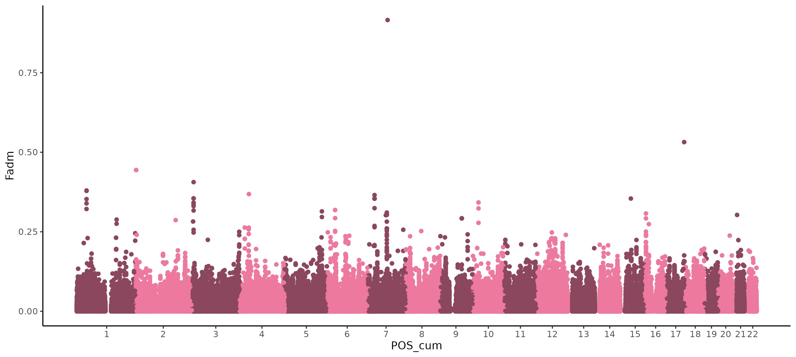
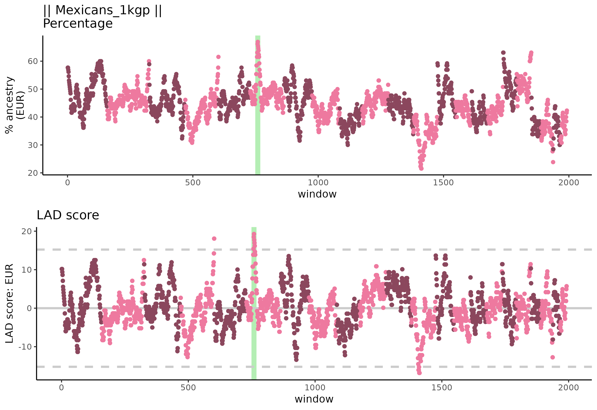
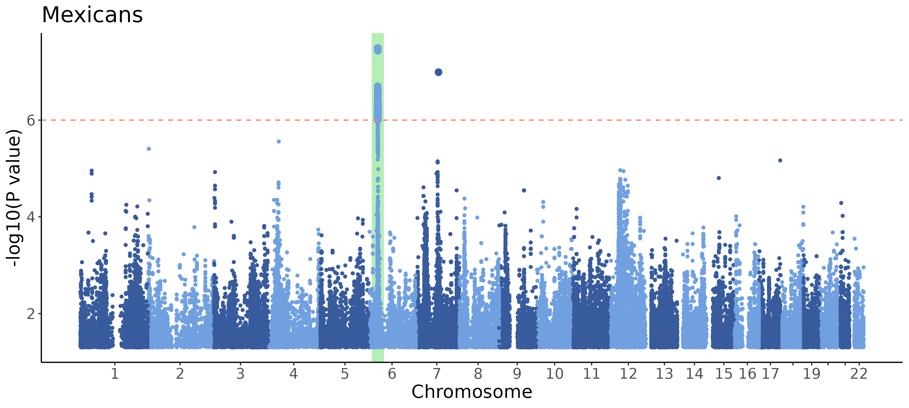

## Overview
This repository contains scripts for a toy example focused on analyzing the ancestry of an admixed population. We explore genetic data from Mexicans in Los Angeles, which was collected as part of the 1000 Genomes Project (1KGP). Our analysis utilizes a reference panel consisting of three populations:

- Spanish (Iberians from 1KGP)
- Sub-Saharan Africans (Yoruba from 1KGP)
- Native Americans (Mayan, Mixe, Zapotec and Pima populations from the Human Genome Diversity Project and Simons Genome Diversity Project)

The goal is to perform local ancestry inference (LAI) with Orchestra (Lerga-Jaso et al. 2023) and to identify signals of natural selection in this admixed population.

## Workflow

The scripts provide a comprehensive workflow that begins with the retrieval of publicly available datasets and culminates in the interpretation of selection signals. The process encompasses:

1. Data Retrieval: Downloading genotype data for designated populations and preparing reference and target panels for analysis.
2. Local Ancestry Inference: Utilizing the Orchestra tool to conduct LAI analysis, as in Lerga-Jaso et al. (2023)
3. Selection analysis: Calculating statistics based on admixture proportions, including Fadm and LAD scores. These scores help identify beneficial mutations in the admixed population, as described in Cuadros-Espinoza et al. (2022). By integrating these scores into a single statistic, we explore the genomes of admixed Mexicans for signs of adaptive admixture, illustrating the analysis methods used in our article with results from Orchestra’s LAI.
 

## Purpose
This toy example serves as an illustrative protocol to demonstrate the application of Orchestra as a local ancestry inference (LAI) tool in a reproducible environment. It replicates the selection signal identified in Cuadros-Espinoza et al. (2022), providing a reproducible example that uses Orchestra instead of RFmix, which was employed in the original study.

## References
* Lerga-Jaso, J., Novković, B., Unnikrishnan, D., Bamunusinghe, V., Hatorangan, M.R., Manson, C., Pedersen, H., Osama, A., Terpolovsky, A., Bohn, S., De Marino, A., Mahmoud, A.A., Bircan, K.O., Khan, U., Grabherr, M.G., Yazdi, P.G. Retracing Human Genetic Histories and Natural Selection Using Precise Local Ancestry Inference. bioRxiv 2023.09.11.557177; doi: https://doi.org/10.1101/2023.09.11.557177
* Cuadros-Espinoza, S., Laval, G., Quintana-Murci, L., Patin, E. The genomic signatures of natural selection in admixed human populations. Am. J. Hum. Genet. 109, 710-726 (2022). doi: 10.1016/j.ajhg.2022.02.011; pmid: 35259336

## Toy example information
Software:
* bcftools and samtools v1.21 for VCF manipulation
* Picard tools for liftover (version 3.0.0; https://broadinstitute.github.io/picard/). It requires Java (we used version 17.0.10)
* Beagle for genotype imputation (v5.4; http://faculty.washington.edu/browning/beagle/beagle.html)
* PLINK v2.00 for SNP frequency calculation
* R language and packages ggplot2, cowplot, magrittr, data.table and dplyr
* Orchestra (https://github.com/omicsedge/orchestra-paper)

Runtime for LAI analysis using Orchestra
* The time required to run LAI analysis using Orchestra can vary depending on several factors including dataset size, hardware specifications and configuration settings. 
On a workstation with 48 CPU cores and 192 GB of RAM, the analysis typically requires about 5 hours for training and 20 minutes for inference, based on the toy example datasets provided here and those of similar sizes.
Please note that larger datasets or less powerful hardware configurations may lead to longer processing times.

The expected output results are:

